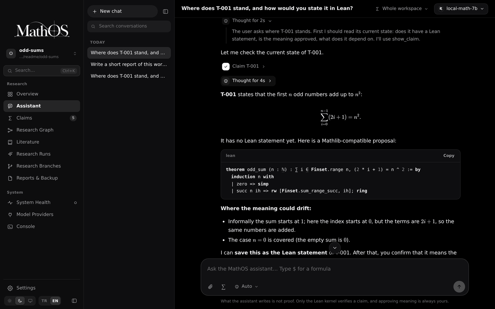
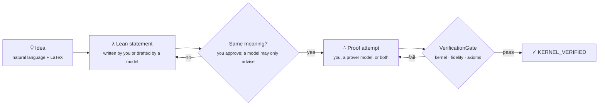
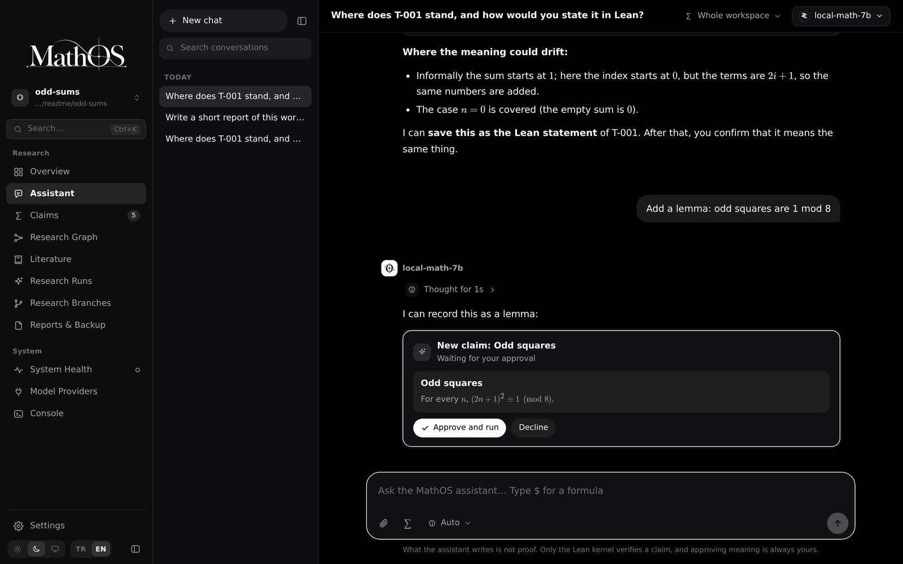
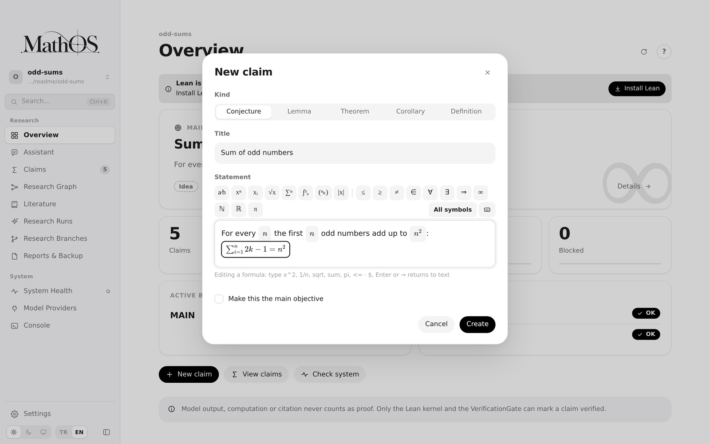
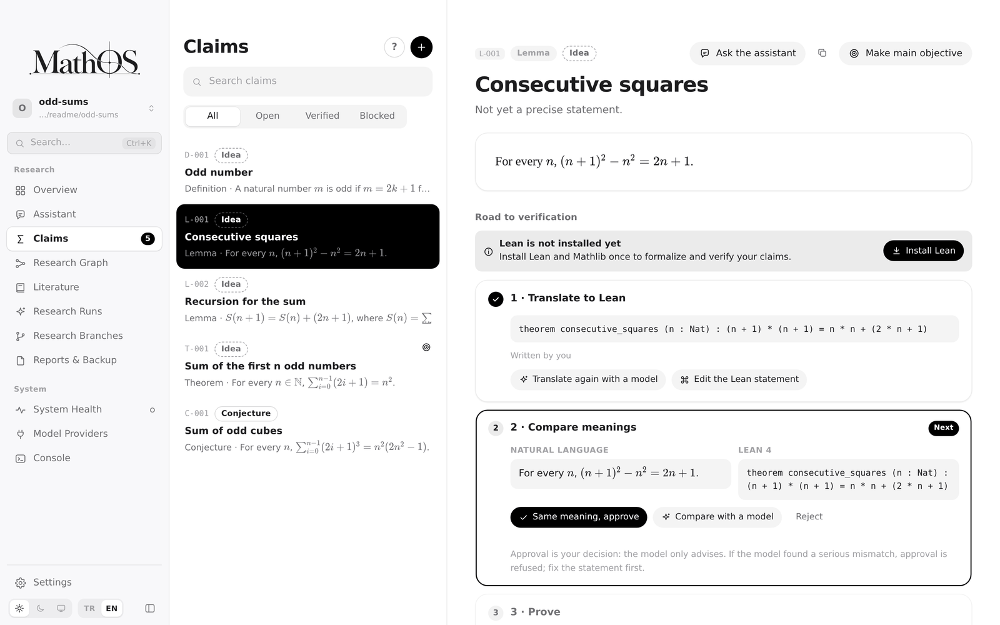
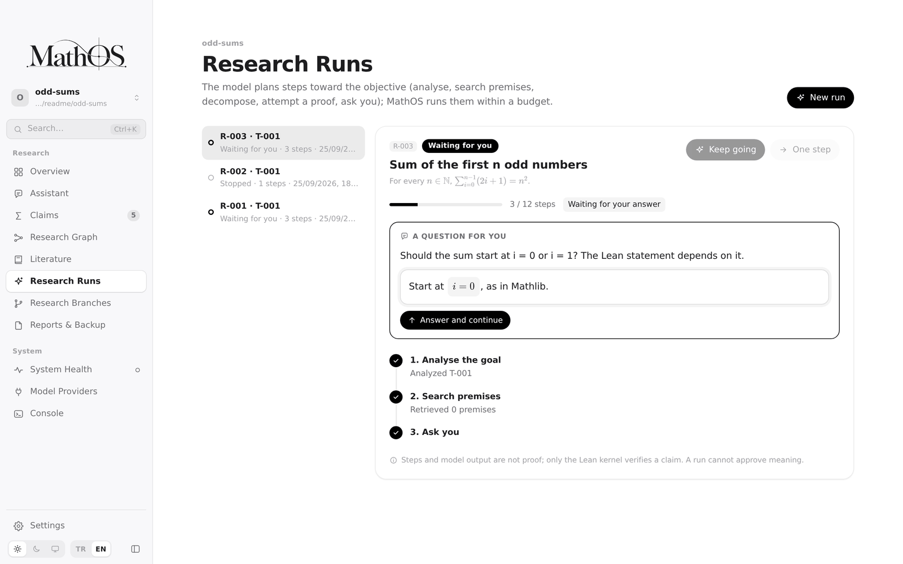
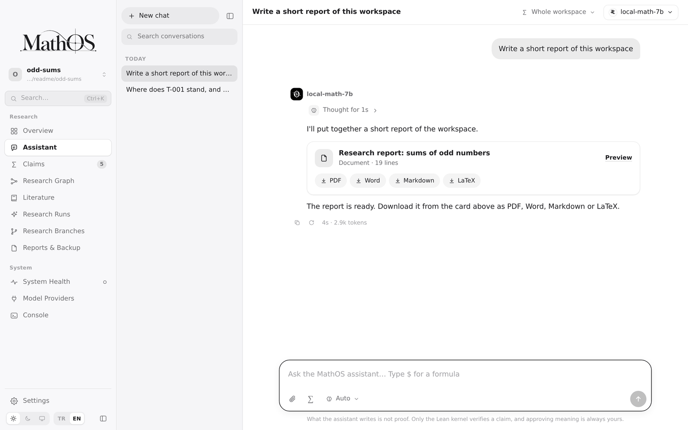
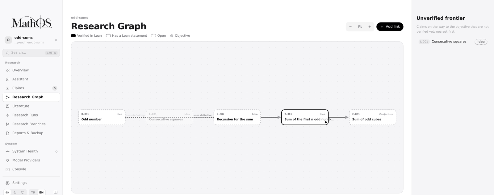
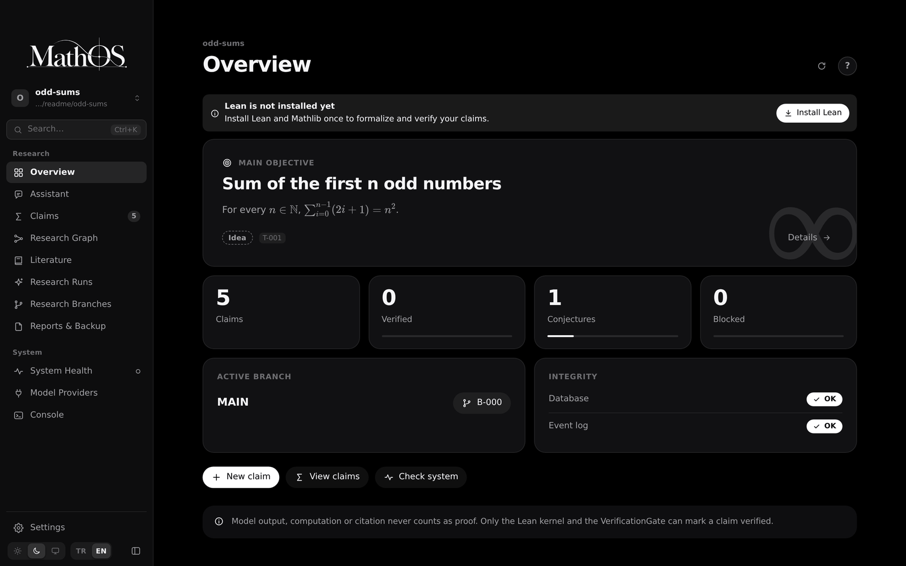

<div align="center">

<picture>
  <source media="(prefers-color-scheme: dark)" srcset="docs/brand/mathos-wordmark-white.svg">
  
</picture>

### A research environment where AI proposes and Lean decides.

Claims, dependencies, Lean formalizations, proof attempts, literature and experiments live in one local workspace.
An AI assistant can work inside it with you. Only the Lean kernel can mark a claim verified.

[](LICENSE)
[](package.json)
[](docs/INSTALLATION.md)
[](apps/desktop/README.md)
[](docs/PROVIDERS.md)

[**Quickstart**](#get-started) · [**Features**](#a-tour) · [**Trust model**](#the-trust-model) · [**Models**](#bring-your-own-model) · [**Docs**](#documentation)

<br>



</div>

<br>

## Why MathOS

Language models are good at suggesting ideas. They are also good at sounding confident about proofs that are wrong. Mathematicians need the first without the risk of the second.

MathOS is not an automatic solver of open problems. It is where your research lives, and it keeps suggestions and proofs apart by design:

- **Everything is a claim with a state.** Conjectures, lemmas, theorems and definitions live in a typed graph with their dependencies, sources and history. Nothing gets lost in a chat window.
- **Models only propose.** An AI can draft a Lean statement, suggest a proof strategy or search the literature. It cannot approve the meaning of a formalization, and it can never mark anything verified.
- **Lean is the only judge.** A claim becomes `KERNEL_VERIFIED` only after its current formal revision passes the local VerificationGate. That covers Lean kernel acceptance, the fidelity policy, forbidden-construct checks and an axiom audit.
- **Local first.** The workspace is a folder on your disk, with an append-only event log, backups and reproducibility capsules. Local models (Ollama, LM Studio, llama.cpp) stay on loopback. Cloud models are off until you allow them.

## The road to verified



Every step is recorded. Every model call is logged with its provider and role. Every verification can be reproduced from the capsule.

## A tour

<table>
<tr>
<td width="50%" valign="top">

**An assistant that works inside your research**

Chat with a model that can see your workspace. It reads claims and searches Mathlib and the literature. It proposes actions such as creating a claim, formalizing, linking or trying a proof, and each action runs only after you approve it. You get live streaming, visible reasoning with timing, a model and effort switcher, and token usage.

</td>
<td width="50%"></td>
</tr>
<tr>
<td width="50%"></td>
<td width="50%" valign="top">

**Write mathematics the way you think it**

Type `$` and a formula opens right inside the sentence. Type `\` and search symbols by name, in English or Turkish ("sum", "toplam", "integral"). There is a symbol bar, a full palette and a virtual keyboard, and everything is stored as clean LaTeX.

</td>
</tr>
<tr>
<td width="50%" valign="top">

**From statement to proof, step by step**

Each claim shows its road to verification: translate to Lean, compare the meanings side by side, prove, verify. Lean is not installed yet? The app installs Lean and Mathlib for you, with progress, cancel and a clear error if something fails.

</td>
<td width="50%"></td>
</tr>
<tr>
<td width="50%"></td>
<td width="50%" valign="top">

**Research runs that know when to ask you**

Give a run an objective and a budget. The planner analyses the goal, searches premises, decomposes the problem and attempts proofs. When a decision is really yours, such as where a sum should start, it stops and asks.

</td>
</tr>
<tr>
<td width="50%" valign="top">

**Documents out, in any format**

Reports and assistant answers export to **PDF, Word, Markdown, LaTeX, Excel or CSV**, with the math intact. Back up a workspace to a single archive and restore it anywhere.

</td>
<td width="50%"></td>
</tr>
</table>

<p align="center"></p>
<p align="center"><sub><b>The research graph</b> shows what depends on what, which claims have a Lean statement and which are verified, and the unverified frontier between you and your objective.</sub></p>

### And much more

| | |
|---|---|
| **Literature** | Search, import and cite sources with provenance. A citation is recorded as `EXTERNAL_SOURCE`, never as proof. |
| **Experiments** | Run computations in a sandbox (Docker on Windows and macOS). Results are `COMPUTATIONAL_EVIDENCE`. |
| **Branches** | Explore alternative approaches without losing the main line, then review and merge them semantically. |
| **Notebooks and capsules** | Reproducible research notebooks, and capsules that let anyone replay a verification. |
| **Publication** | Deterministic export of verified results with their full dependency closure. |
| **Atlas** | A read-only web view of the workspace, served on loopback. |
| **VS Code** | A companion extension with the objective, claims, provider status and Atlas in the sidebar. |
| **Plugins** | Out-of-process plugins with capability-scoped access and no verification authority. |
| **Terminal UI** | A complete TUI and a scriptable CLI with `--json` everywhere. |
| **Bilingual** | The desktop interface is available in English and Turkish, with guided tours on every screen. |

## Get started

### Desktop app

The desktop app (Tauri 2 + React) is the easiest way in. It drives the same engine as the CLI, so the trust rules are identical.

- **Windows:** download `MathOS-windows-x64-setup` from the latest successful [Desktop · Windows](https://github.com/bakiacikgoz/MathOS/actions/workflows/desktop-windows.yml) run and run the installer. If SmartScreen appears, choose *More info → Run anyway*.
- **macOS and Linux:** build from source, as described in the [desktop README](apps/desktop/README.md).

On first launch, pick a folder or create a workspace (or open the sample project). Connect a model under **Model Providers**. Then install Lean from **System Health** with one click.

<p align="center"></p>

### Command line

Download the release archive for your platform, verify it against `SHA256SUMS` and put `mathos` on your path. The user-scoped installer does all of this without sudo. See [installation](docs/INSTALLATION.md).

```sh
mathos --version --json
mathos help
mkdir prime-gap-research && cd prime-gap-research
mathos init --name prime-gap-research
mathos claim create --type conjecture --title "Bounded prime gaps" \
  --statement "There are infinitely many bounded gaps between consecutive primes."
mathos lean install --accept-downloads=lean,mathlib   # pinned Lean 4 + Mathlib, about 6 GB
mathos claims --json
mathos atlas --no-open              # read-only browser view on loopback
```

Continue with the [quickstart](docs/QUICKSTART.md) or explore the [professional demo](examples/professional-demo/README.md).

## Bring your own model

MathOS ships more than 60 provider presets. Pick the one you already pay for, or keep everything on your own machine.

| Kind | Examples |
|---|---|
| **Local** | Ollama · LM Studio · llama.cpp |
| **Subscriptions** | ChatGPT (Codex) · GitHub Copilot · Kimi Code · OpenCode Go · MiniMax token plans |
| **APIs** | OpenAI · Anthropic · Gemini · DeepSeek · Mistral · Groq · Together · Fireworks · OpenRouter · … |
| **Enterprise** | Google Vertex · Gemini CLI Enterprise |
| **Anything else** | Any OpenAI- or Anthropic-compatible endpoint, with custom headers |

```sh
mathos provider catalog
mathos provider configure openai-codex-chatgpt --profile codex-personal
mathos provider login codex-personal
mathos provider use codex-personal
```

Keys go to the operating system's secret store. They are never passed on the command line and never written to logs. A subscription profile and a pay-as-you-go API profile are always separate profiles. Fallback never crosses billing or local/remote boundaries unless you enable it. See [provider setup](docs/PROVIDERS.md), [provider security](docs/PROVIDER_SECURITY.md) and the [terms matrix](docs/PROVIDER_TERMS_MATRIX.md).

## The trust model

| Source | What it counts as | Can it verify a claim? |
|---|---|:---:|
| Lean kernel through the VerificationGate | Proof | **Yes** |
| Your approval of a formalization | Meaning is faithful | No, but it is required first |
| Model output (assistant, prover, planner) | Proposal | No |
| Computation and experiments | `COMPUTATIONAL_EVIDENCE` | No |
| Literature and citations | `EXTERNAL_SOURCE` | No |
| Plugins | Out-of-process tool | No |

A capability that is missing, such as Lean not installed, no sandbox or a provider that is not configured, shows up as `BLOCKED` and never as a fake success. See the [trust model](docs/TRUST_MODEL_V1.md) and the [security model](docs/SECURITY_MODEL_V1.md).

## Architecture

```
apps/
  desktop/            Tauri 2 + React app; a warm Bun host runs the CLI in-process
  tui/                CLI and terminal UI (the single entry point everything drives)
  atlas/              read-only web view
  vscode-extension/   VS Code companion
packages/
  core/               research services, assistant agent, workflows
  domain/  events/  storage/  workspace/     typed model, event log, SQLite projections
  lean/               pinned toolchain, installer, VerificationGate
  models/             provider catalog, transports, streaming, secret store
  graph/  retrieval/  literature/  solvers/  computation/
  notebook/  publication/  plugins/  vcs/  update/  shared/
```

## Documentation

[Quickstart](docs/QUICKSTART.md) · [Installation](docs/INSTALLATION.md) · [Features](docs/FEATURES.md) · [Alignment workflow](docs/ALIGNMENT_WORKFLOW.md) · [Providers](docs/PROVIDERS.md) · [Trust model](docs/TRUST_MODEL_V1.md) · [Security](docs/SECURITY_MODEL_V1.md) · [Operations](docs/OPERATIONS.md) · [Error codes](docs/ERROR_CODES.md) · [Atlas](docs/ATLAS_GUIDE.md) · [Plugin SDK](docs/PLUGIN_SDK_V1.md) · [Support](docs/SUPPORT.md)

## Development

You need [Bun](https://bun.sh) 1.4.1 or newer. Older versions cannot read `bun.lock` and produce a bundle that crashes at startup.

```sh
bun install
bun run typecheck
bun test
bun run build
bun run desktop:dev      # desktop app with hot reload
```

## License

Copyright © 2026 Baki Açıkgöz. MathOS is licensed under the [GNU Affero General Public License v3.0](LICENSE) (AGPL-3.0-only).

You may use, study and change MathOS freely. If you distribute it, or run a modified version as a service for others, you must publish the complete source of that version under the same license. Closed-source products and services built on MathOS are not allowed under the AGPL. **Commercial licenses** for other uses are available on request through [GitHub](https://github.com/bakiacikgoz).

The MathOS name and logo are not covered by the license. See [NOTICE](NOTICE).
